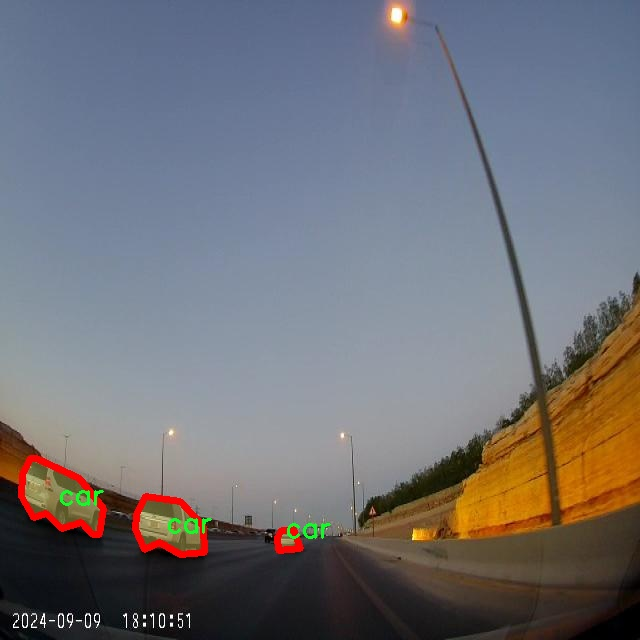

# 道路标线与车辆分割系统源码＆数据集分享
 [yolov8-seg-slimneck＆yolov8-seg-C2f-FocusedLinearAttention等50+全套改进创新点发刊_一键训练教程_Web前端展示]

### 1.研究背景与意义

项目参考[ILSVRC ImageNet Large Scale Visual Recognition Challenge](https://gitee.com/YOLOv8_YOLOv11_Segmentation_Studio/projects)

项目来源[AAAI Global Al lnnovation Contest](https://kdocs.cn/l/cszuIiCKVNis)

研究背景与意义

随着城市化进程的加快，交通管理的复杂性日益增加，尤其是在道路交通安全和效率方面。道路标线作为交通管理的重要组成部分，起着引导和规范车辆行驶的重要作用。然而，传统的道路标线检测方法往往依赖于人工标注和经验判断，效率低下且易受环境因素的影响。因此，开发一种高效、准确的道路标线与车辆分割系统显得尤为重要。近年来，深度学习技术的迅猛发展为解决这一问题提供了新的思路，尤其是基于卷积神经网络（CNN）的目标检测与分割模型，如YOLO（You Only Look Once）系列模型，因其在实时性和准确性方面的优越表现而受到广泛关注。

本研究旨在基于改进的YOLOv8模型，构建一个高效的道路标线与车辆分割系统。YOLOv8作为YOLO系列的最新版本，具有更强的特征提取能力和更快的推理速度，能够在复杂的交通场景中实现高精度的目标检测与分割。通过对YOLOv8模型的改进，我们可以进一步提升其在道路标线和车辆识别中的表现，尤其是在多类别目标的情况下。研究中使用的数据集“Road-Lines-Segmentation 3”包含7900张图像，涵盖了三类目标：车辆、车牌和实线黄线。这一数据集的丰富性和多样性为模型的训练和验证提供了良好的基础。

在当前的交通管理中，准确识别和分割道路标线与车辆不仅可以提高交通流量的管理效率，还能有效降低交通事故的发生率。通过自动化的检测与分割系统，交通管理部门可以实时监控道路状况，及时发现和处理交通违规行为，从而提升城市交通的安全性和流畅性。此外，该系统的应用还可以为智能驾驶技术的发展提供支持，助力自动驾驶车辆在复杂环境中做出更为准确的决策。

本研究的意义不仅在于技术层面的创新，更在于其对实际交通管理和智能交通系统的推动作用。通过改进YOLOv8模型，我们希望能够为未来的智能交通解决方案提供一种新的思路和方法，促进交通安全和效率的提升。同时，本研究也为相关领域的学术研究提供了新的数据集和实验结果，推动了计算机视觉与交通管理的交叉研究进展。

综上所述，基于改进YOLOv8的道路标线与车辆分割系统的研究，不仅具有重要的理论价值，也具有广泛的应用前景。通过深入探索这一领域，我们期待能够为未来的智能交通系统建设贡献一份力量，为城市交通的可持续发展提供有力支持。

### 2.图片演示


##### 注意：由于此博客编辑较早，上面“2.图片演示”和“3.视频演示”展示的系统图片或者视频可能为老版本，新版本在老版本的基础上升级如下：（实际效果以升级的新版本为准）

  （1）适配了YOLOV8的“目标检测”模型和“实例分割”模型，通过加载相应的权重（.pt）文件即可自适应加载模型。

  （2）支持“图片识别”、“视频识别”、“摄像头实时识别”三种识别模式。

  （3）支持“图片识别”、“视频识别”、“摄像头实时识别”三种识别结果保存导出，解决手动导出（容易卡顿出现爆内存）存在的问题，识别完自动保存结果并导出到tempDir中。

  （4）支持Web前端系统中的标题、背景图等自定义修改，后面提供修改教程。

  另外本项目提供训练的数据集和训练教程,暂不提供权重文件（best.pt）,需要您按照教程进行训练后实现图片演示和Web前端界面演示的效果。

### 3.视频演示

[3.1 视频演示](https://www.bilibili.com/video/BV1uR26YHEFd/)

### 4.数据集信息展示

##### 4.1 本项目数据集详细数据（类别数＆类别名）

nc: 3
names: ['car', 'license_plate', 'solid-yellow-line']


##### 4.2 本项目数据集信息介绍

数据集信息展示

在现代智能交通系统中，准确的道路标线与车辆分割技术至关重要，尤其是在自动驾驶和智能监控领域。为此，我们构建了一个名为“Road-Lines-Segmentation 3”的数据集，旨在为改进YOLOv8-seg模型提供丰富的训练数据。该数据集专注于三个主要类别：车辆（car）、车牌（license_plate）和实线黄线（solid-yellow-line），这些类别的选择反映了在道路场景中最常见且重要的元素。

“Road-Lines-Segmentation 3”数据集的设计考虑到了多样性和复杂性，以确保模型在不同环境下的鲁棒性。数据集中包含了大量的图像样本，这些样本来自于城市、乡村和高速公路等多种场景，涵盖了不同的天气条件和光照变化。这种多样性不仅有助于提高模型的泛化能力，还能增强其在实际应用中的适应性。例如，在阳光明媚的日子里，车辆和道路标线的视觉特征可能与阴雨天气下的表现截然不同，因此，数据集中的样本涵盖了这些变化，以确保模型能够在各种情况下都能准确识别和分割目标。

在类别方面，车辆（car）是数据集中最为重要的组成部分之一。车辆的种类繁多，从小型轿车到大型货车，甚至包括摩托车和公共交通工具。数据集中的车辆样本经过精心挑选，确保涵盖了不同品牌、颜色和形状的车辆，以提高模型对车辆的识别精度。车牌（license_plate）作为另一个关键类别，包含了多种不同国家和地区的车牌样式，确保模型能够识别各种格式的车牌信息。这对于智能交通系统的车辆识别和管理具有重要意义，能够为后续的交通监控和管理提供支持。

此外，实线黄线（solid-yellow-line）作为数据集中的最后一个类别，代表了道路标线的重要组成部分。实线黄线在交通规则中起着重要的指示作用，通常用于分隔车道或禁止超车。数据集中包含了多种不同状态和角度的实线黄线样本，确保模型能够准确识别和分割这些标线。通过对这些类别的深入分析和标注，我们的目标是提高YOLOv8-seg模型在道路标线与车辆分割任务中的表现，使其在实际应用中更加可靠和高效。

总之，“Road-Lines-Segmentation 3”数据集为改进YOLOv8-seg模型提供了一个丰富而多样的训练基础。通过精心设计的类别选择和多样化的样本，数据集不仅有助于提升模型的分割精度，还能增强其在复杂交通环境中的适应能力。随着智能交通技术的不断发展，我们相信这一数据集将为相关研究和应用提供重要的支持，推动道路安全和交通管理的进一步进步。




### 5.全套项目环境部署视频教程（零基础手把手教学）

[5.1 环境部署教程链接（零基础手把手教学）](https://www.bilibili.com/video/BV1jG4Ve4E9t/?vd_source=bc9aec86d164b67a7004b996143742dc)


[5.2 安装Python虚拟环境创建和依赖库安装视频教程链接（零基础手把手教学）](https://www.bilibili.com/video/BV1nA4VeYEze/?vd_source=bc9aec86d164b67a7004b996143742dc)

### 6.手把手YOLOV8-seg训练视频教程（零基础小白有手就能学会）

[6.1 手把手YOLOV8-seg训练视频教程（零基础小白有手就能学会）](https://www.bilibili.com/video/BV1cA4VeYETe/?vd_source=bc9aec86d164b67a7004b996143742dc)


按照上面的训练视频教程链接加载项目提供的数据集，运行train.py即可开始训练



     Epoch   gpu_mem       box       obj       cls    labels  img_size
     1/200     0G   0.01576   0.01955  0.007536        22      1280: 100%|██████████| 849/849 [14:42<00:00,  1.04s/it]
               Class     Images     Labels          P          R     mAP@.5 mAP@.5:.95: 100%|██████████| 213/213 [01:14<00:00,  2.87it/s]
                 all       3395      17314      0.994      0.957      0.0957      0.0843

     Epoch   gpu_mem       box       obj       cls    labels  img_size
     2/200     0G   0.01578   0.01923  0.007006        22      1280: 100%|██████████| 849/849 [14:44<00:00,  1.04s/it]
               Class     Images     Labels          P          R     mAP@.5 mAP@.5:.95: 100%|██████████| 213/213 [01:12<00:00,  2.95it/s]
                 all       3395      17314      0.996      0.956      0.0957      0.0845

     Epoch   gpu_mem       box       obj       cls    labels  img_size
     3/200     0G   0.01561    0.0191  0.006895        27      1280: 100%|██████████| 849/849 [10:56<00:00,  1.29it/s]
               Class     Images     Labels          P          R     mAP@.5 mAP@.5:.95: 100%|███████   | 187/213 [00:52<00:00,  4.04it/s]
                 all       3395      17314      0.996      0.957      0.0957      0.0845


### 7.50+种全套YOLOV8-seg创新点代码加载调参视频教程（一键加载写好的改进模型的配置文件）

[7.1 50+种全套YOLOV8-seg创新点代码加载调参视频教程（一键加载写好的改进模型的配置文件）](https://www.bilibili.com/video/BV1Hw4VePEXv/?vd_source=bc9aec86d164b67a7004b996143742dc)

### 8.YOLOV8-seg图像分割算法原理

原始YOLOv8-seg算法原理

YOLOv8-seg算法是目标检测和实例分割领域的一个重要进展，代表了YOLO系列模型的最新发展。自2023年1月发布以来，YOLOv8通过结合前代模型的优点，特别是YOLOv5、YOLOv6、YOLOX和PP-YOLOE等，极大地提升了检测精度和速度。该算法的设计旨在实现高效的实时目标检测，同时兼顾了实例分割的需求，成为计算机视觉领域中的一颗璀璨明珠。

YOLOv8的核心结构由三个主要部分组成：骨干特征提取网络、特征融合层和检测头层。与之前的YOLO版本相比，YOLOv8在这些组件上进行了显著的优化和改进。首先，在骨干特征提取网络中，YOLOv8采用了更轻量化的C2F模块替代了原有的C3模块。这一变化不仅减少了计算复杂度，还提高了特征提取的效率。C2F模块通过引入更多的跳层连接和Split操作，使得信息流动更加顺畅，从而在特征提取过程中保留了更多的细节信息。

特征融合层的设计同样经过了深思熟虑。YOLOv8采用了特征金字塔网络（FPN）与路径聚合网络（PAN）的结合，形成了一个强大的特征融合机制。为了进一步提升模型的轻量化和高效性，YOLOv8引入了BiFPN网络。BiFPN的核心思想是通过高效的双向跨尺度连接和加权特征融合，优化了不同尺度特征信息的提取过程。这种方法不仅提升了特征融合的速度，还增强了模型对多尺度目标的检测能力，使得YOLOv8在处理复杂场景时表现得更加出色。

在检测头层，YOLOv8的创新尤为显著。原有的耦合头被解耦头所替代，检测过程中的Anchor-Free策略使得模型在处理目标时更加灵活。传统的Anchor-Based方法往往需要手动设置锚框，而YOLOv8通过解耦的分类和回归分支，简化了这一过程。这种设计不仅提高了检测精度，还减少了模型的复杂性，使得YOLOv8在各种硬件平台上都能高效运行。

YOLOv8还在损失函数的设计上进行了创新，以适应其新的网络结构。新的损失函数不仅考虑了分类和回归的精度，还引入了对小目标的检测能力，使得YOLOv8在高分辨率图像处理时表现得尤为突出。这一改进使得YOLOv8在实例分割任务中能够有效地识别和分割出细小的目标，进一步拓宽了其应用范围。

在实际应用中，YOLOv8的高效性和准确性使其成为了自动化领域的理想选择。例如，在苹果采摘的场景中，YOLOv8可以快速识别和定位苹果，为自动采摘机器人提供必要的视觉信息。结合蚁群算法进行路径规划，能够有效提高采摘效率，降低人工成本。这一应用不仅展示了YOLOv8在农业领域的潜力，也为其他行业的自动化提供了借鉴。

总的来说，YOLOv8-seg算法的原理和设计理念体现了对目标检测和实例分割技术的深刻理解与创新。通过轻量化的网络结构、先进的特征融合方法和灵活的检测策略，YOLOv8在实时检测和高精度分割任务中达到了新的高度。未来，随着计算机视觉技术的不断发展，YOLOv8无疑将在更多应用场景中发挥重要作用，推动相关领域的进步与创新。


### 9.系统功能展示（检测对象为举例，实际内容以本项目数据集为准）

图9.1.系统支持检测结果表格显示

  图9.2.系统支持置信度和IOU阈值手动调节

  图9.3.系统支持自定义加载权重文件best.pt(需要你通过步骤5中训练获得)

  图9.4.系统支持摄像头实时识别

  图9.5.系统支持图片识别

  图9.6.系统支持视频识别

  图9.7.系统支持识别结果文件自动保存

  图9.8.系统支持Excel导出检测结果数据


### 10.50+种全套YOLOV8-seg创新点原理讲解（非科班也可以轻松写刊发刊，V11版本正在科研待更新）

#### 10.1 由于篇幅限制，每个创新点的具体原理讲解就不一一展开，具体见下列网址中的创新点对应子项目的技术原理博客网址【Blog】：


[10.1 50+种全套YOLOV8-seg创新点原理讲解链接](https://gitee.com/qunmasj/good)

#### 10.2 部分改进模块原理讲解(完整的改进原理见上图和技术博客链接)【如果此小节的图加载失败可以通过CSDN或者Github搜索该博客的标题访问原始博客，原始博客图片显示正常】
### YOLOv8简介
YOLOv8目标检测算法继承了YOLOv1系列的思考,是一种新型端到端的目标检测算法,尽管现在原始检测算法已经开源,但是鲜有发表的相关论文.YOLOv8的网络结构如图所示,主要可分为Input输入端、Backbone骨干神经网络、Neck 混合特征网络层和Head预测层网络共4个部分.

YOLO目标检测算法是一种端到端的One-Slage 目标检测算法，其核心思想是将图像按区域分块进行预测。YOLO将输入图像按照32x32的大小划分成若干个网格，例如416x416的图像将被划分为13x13个网格。当目标物体的中心位于某个网格内时,该网格就会负责输出该物体的边界框和类别置信度。每个网格可以预测多个边界框和多个目标类别,这些边界框和类别的数量可以根据需要进行设置。YOLO算法的输出是一个特征图,包含了每个网格对应的边界框和类别置信度的信息呵。本文采用YOLO最新的YOLOv8模型，其是2022年底发布的最新YOLO系列模型，采用全新的SOTA模型，全新的网络主干结构,如图1所示。
整个网络分为Backbone 骨干网络部分和Head头部网络部分。YOLOv8汲取了前几代网络的优秀特性，骨干网络和 Neck部分遵循CSP的思想，将YOLOv5中的C3模块被替换成了梯度流更丰富C2模块,去掉YOLOv5中 PAN-FPN上采样阶段中的卷积结构,将Backbone不同阶段输出的特征直接送入了上采样操作,模型提供了N/S/M/L/X尺度的不同大小模型,能够满足不同领域业界的需求。本文基于YOLOv8模型设计番茄病虫害检测系统，通过配置模型参数训练番茄图像,得到能够用于部署应用的最优模型。


### 感受野注意力卷积（RFAConv)
#### 标准卷积操作回顾
标准的卷积操作是构造卷积神经网络的基本构件。它利用具有共享参数的滑动窗口提取特征信息，克服了全连通层构造神经网络固有的参数多、计算开销大的问题。设 X R∈C×H×W
表示输入特征图，其中C、H、W分别表示特征图的通道数、高度、宽度。为了清楚地演示卷积核的特征提取过程，我们使用 C = 1 的例子。从每个接受域滑块中提取特征信息的卷积运算可以表示为:


这里，Fi 表示计算后每个卷积滑块得到的值，Xi 表示每个滑块内对应位置的像素值，K表示卷积核，S表示卷积核中的参数个数，N表示接收域滑块的总数。可以看出，每个滑块内相同位置的 feature共享相同的参数Ki。因此，标准的卷积运算并不能捕捉到不同位置所带来的信息差异，这最终在一定程度上限制了卷积神经网络的性能。 

#### 空间注意力回顾
目前，空间注意机制是利用学习得到的注意图来突出每个特征的重要性。与前一节类似，这里以 C=1为例。突出关键特征的空间注意机制可以简单表述为:这里，Fi 表示加权运算后得到的值。xi 和Ai 表示输入特征图和学习到的注意图在不同位置的值，N为输入特征图的高和宽的乘积，表示像素值的总数。


#### 空间注意与标准卷积运算
将注意力机制整合到卷积神经网络中，可以提高卷积神经网络的性能。通过对标准卷积运算和现有空间注意机制的研究，我们认为空间注意机制有效地克服了卷积神经网络固有的参数共享的局限性。目前卷积神经网络中最常用的核大小是 1 × 1和3 × 3。在引入空间注意机制后，提取特征的卷积操作可以是 1 × 1或3 × 3卷积操作。为了直观地展示这个过程，在 1 × 1卷积运算的前面插入了空间注意机制。通过注意图对输入特征图(Re-weight“×”)进行加权运算，最后通过 1 × 1卷积运算提取接收域的滑块特征信息。整个过程可以简单地表示如下:


 这里卷积核K仅代表一个参数值。如果取A i× ki 的值作为一种新的卷积核参数，有趣的是它解决了 1×1卷积运算提取特征时的参数共享问题。然而，关于空间注意机制的传说到此结束。当空间注意机制被插入到3×3卷积运算前面时。具体情况如下:


如上所述，如果取A的值 i × ki (4)式作为一种新的卷积核参数，完全解决了大规模卷积核的参数共享问题。然而，最重要的一点是，卷积核在提取每个接受域滑块的特征时，会共享一些特征。换句话说，每个接收域滑块内都有一个重叠。仔细分析后会发现A12= a21， a13 = a22， a15 = a24……，在这种情况下，每个滑动窗口共享空间注意力地图的权重。因此，空间注意机制没有考虑整个接受域的空间特征，不能有效地解决大规模卷积核的参数共享问题。因此，空间注意机制的有效性受到限制。 

#### 创新空间注意力和标准卷积操作
该博客提出解决了现有空间注意机制的局限性，为空间处理提供了一种创新的解决方案。受RFA的启发，一系列空间注意机制被开发出来，可以进一步提高卷积神经网络的性能。RFA可以看作是一个轻量级即插即用模块，RFA设计的卷积运算(RFAConv)可以代替标准卷积来提高卷积神经网络的性能。因此，我们预测空间注意机制与标准卷积运算的结合将继续发展，并在未来带来新的突破。
接受域空间特征:为了更好地理解接受域空间特征的概念，我们将提供相关的定义。接收域空间特征是专门为卷积核设计的，并根据核大小动态生成。如图1所示，以3×3卷积核为例。在图1中，“Spatial Feature”指的是原始的Feature map。“接受域空间特征”是空间特征变换后的特征图。

 

由不重叠的滑动窗口组成。当使用 3×3卷积内核提取特征时，接收域空间特征中的每个 3×3大小窗口代表一个接收域滑块。接受域注意卷积(RFAConv):针对接受域的空间特征，我们提出了接受域注意卷积(RFA)。该方法不仅强调了接收域滑块内不同特征的重要性，而且对接收域空间特征进行了优先排序。通过该方法，完全解决了卷积核参数共享的问题。接受域空间特征是根据卷积核的大小动态生成的，因此，RFA是卷积的固定组合，不能与卷积操作的帮助分离，卷积操作同时依赖于RFA来提高性能，因此我们提出了接受场注意卷积(RFAConv)。具有3×3大小的卷积核的RFAConv整体结构如图所示。


目前，最广泛使用的接受域特征提取方法是缓慢的。经过大量的研究，我们开发了一种快速的方法，用分组卷积来代替原来的方法。具体来说，我们利用相应大小的分组卷积来动态生成基于接受域大小的展开特征。尽管与原始的无参数方法(如PyTorch提供的nn.())相比，该方法增加了一些参数，但它的速度要快得多。注意:如前一节所述，当使用 3×3卷积内核提取特征时，接收域空间特征中的每个 3×3大小窗口表示一个接收域滑块。而利用快速分组卷积提取感受野特征后，将原始特征映射为新的特征。最近的研究表明。交互信息可以提高网络性能，如[40,41,42]所示。同样，对于RFAConv来说，通过交互接受域特征信息来学习注意图可以提高网络性能。然而，与每个接收域特征交互会导致额外的计算开销，因此为了最小化计算开销和参数的数量，我们使用AvgPool来聚合每个接收域特征的全局信息。然后，使用 1×1 组卷积操作进行信息交互。最后，我们使用softmax来强调每个特征在接受域特征中的重要性。一般情况下，RFA的计算可以表示为:


这里gi×i 表示一个大小为 i×i的分组卷积，k表示卷积核的大小，Norm表示归一化，X表示输入的特征图，F由注意图 a相乘得到 rf 与转换后的接受域空间特征 Frf。与CBAM和CA不同，RFA能够为每个接受域特征生成注意图。卷积神经网络的性能受到标准卷积操作的限制，因为卷积操作依赖于共享参数，对位置变化带来的信息差异不敏感。然而，RFAConv通过强调接收域滑块中不同特征的重要性，并对接收域空间特征进行优先级排序，可以完全解决这个问题。通过RFA得到的feature map是接受域空间特征，在“Adjust Shape”后没有重叠。因此，学习到的注意图将每个接受域滑块的特征信息聚合起来。换句话说，注意力地图不再共享在每个接受域滑块。这完全弥补了现有 CA和CBAM注意机制的不足。RFA为标准卷积内核提供了显著的好处。而在调整形状后，特征的高度和宽度是 k倍，需要进行 stride = k的k × k卷积运算来提取特征信息。RFA设计的卷积运算RFAConv为卷积带来了良好的增益，对标准卷积进行了创新。
此外，我们认为现有的空间注意机制应该优先考虑接受域空间特征，以提高网络性能。众所周知，基于自注意机制的网络模型[43,44,45]取得了很大的成功，因为它解决了卷积参数共享的问题，并对远程信息进行建模。然而，自注意机制也为模型引入了显著的计算开销和复杂性。我们认为，将现有的空间注意机制的注意力引导到接受场空间特征上，可以以类似于自我注意的方式解决长期信息的参数共享和建模问题。与自我关注相比，这种方法需要的参数和计算资源少得多。答案如下:(1)将以接收场空间特征为中心的空间注意机制与卷积相结合，消除了卷积参数共享的问题。(2)现有的空间注意机制已经考虑了远程信息，可以通过全局平均池或全局最大池的方式获取全局信息，其中明确考虑了远程信息。因此，我们设计了新的 CBAM和CA模型，称为RFCBAM和RFCA，它们专注于接受域空间特征。与RFA类似，使用最终的k × k stride = k 的卷积运算来提取特征信息。这两种新的卷积方法的具体结构如图 3所示，我们称这两种新的卷积操作为 RFCBAMConv和RFCAConv。与原来的CBAM相比，我们在RFCBAM中使用SE attention来代替CAM。因为这样可以减少计算开销。此外，在RFCBAM中，通道注意和空间注意不是分开执行的。相反，它们是同时加权的，使得每个通道获得的注意力地图是不同的。


### 11.项目核心源码讲解（再也不用担心看不懂代码逻辑）

#### 11.1 ui.py

以下是经过简化和注释的核心代码部分：

```python
import sys
import subprocess
from QtFusion.path import abs_path

def run_script(script_path):
    """
    使用当前 Python 环境运行指定的脚本。

    Args:
        script_path (str): 要运行的脚本路径
    """
    # 获取当前 Python 解释器的路径
    python_path = sys.executable

    # 构建运行命令，使用 streamlit 运行指定的脚本
    command = f'"{python_path}" -m streamlit run "{script_path}"'

    # 执行命令并等待其完成
    result = subprocess.run(command, shell=True)
    
    # 检查命令执行结果，如果返回码不为0，表示出错
    if result.returncode != 0:
        print("脚本运行出错。")

# 主程序入口
if __name__ == "__main__":
    # 获取要运行的脚本的绝对路径
    script_path = abs_path("web.py")

    # 调用函数运行指定的脚本
    run_script(script_path)
```

### 代码注释说明：
1. **导入模块**：
   - `sys`：用于获取当前 Python 解释器的路径。
   - `subprocess`：用于执行外部命令。
   - `abs_path`：从 `QtFusion.path` 导入的函数，用于获取文件的绝对路径。

2. **`run_script` 函数**：
   - 接受一个参数 `script_path`，表示要运行的 Python 脚本的路径。
   - 使用 `sys.executable` 获取当前 Python 解释器的路径。
   - 构建命令字符串，使用 `streamlit` 模块运行指定的脚本。
   - 使用 `subprocess.run` 执行命令，并等待其完成。
   - 检查命令的返回码，如果不为0，则打印错误信息。

3. **主程序入口**：
   - 使用 `if __name__ == "__main__":` 确保代码仅在直接运行时执行。
   - 获取要运行的脚本的绝对路径（`web.py`）。
   - 调用 `run_script` 函数来执行该脚本。

这个文件名为 `ui.py`，它的主要功能是运行一个指定的 Python 脚本，具体是通过 Streamlit 框架来启动一个 Web 应用。代码的结构比较简单，主要由几个部分组成。

首先，文件导入了必要的模块，包括 `sys`、`os` 和 `subprocess`。`sys` 模块用于访问与 Python 解释器相关的变量和函数，`os` 模块提供了与操作系统交互的功能，而 `subprocess` 模块则用于创建新进程、连接到它们的输入/输出/错误管道，并获取它们的返回码。

接下来，代码定义了一个名为 `run_script` 的函数，该函数接受一个参数 `script_path`，表示要运行的脚本的路径。在函数内部，首先获取当前 Python 解释器的路径，这通过 `sys.executable` 实现。然后，构建一个命令字符串，使用 `streamlit run` 命令来运行指定的脚本。这个命令将被传递给 `subprocess.run` 函数，该函数会在一个新的 shell 中执行这个命令。

在执行命令后，代码检查返回的结果。如果返回码不为零，表示脚本运行出错，程序会打印出相应的错误信息。

最后，代码通过 `if __name__ == "__main__":` 这一条件判断来确保只有在直接运行该脚本时才会执行以下代码。在这里，指定了要运行的脚本路径为 `web.py`，这个路径是通过 `abs_path` 函数获取的，确保路径是绝对路径。然后调用 `run_script` 函数来执行这个脚本。

总的来说，这个 `ui.py` 文件的功能是启动一个 Streamlit Web 应用，通过运行指定的 Python 脚本 `web.py`。它的实现方式是利用当前 Python 环境来执行命令行指令，确保用户能够方便地启动 Web 应用。

#### 11.2 ultralytics\utils\callbacks\raytune.py

以下是经过简化和注释的核心代码部分：

```python
# 导入必要的库
from ultralytics.utils import SETTINGS

# 尝试导入Ray和Ray Tune库，并验证Ray Tune集成是否启用
try:
    assert SETTINGS['raytune'] is True  # 验证Ray Tune集成是否启用
    import ray
    from ray import tune
    from ray.air import session
except (ImportError, AssertionError):
    tune = None  # 如果导入失败或集成未启用，则将tune设置为None

def on_fit_epoch_end(trainer):
    """在每个训练周期结束时，将训练指标发送到Ray Tune。"""
    if ray.tune.is_session_enabled():  # 检查Ray Tune会话是否启用
        metrics = trainer.metrics  # 获取当前训练指标
        metrics['epoch'] = trainer.epoch  # 添加当前周期信息
        session.report(metrics)  # 将指标报告给Ray Tune

# 如果tune可用，则定义回调函数；否则，回调为空字典
callbacks = {
    'on_fit_epoch_end': on_fit_epoch_end,  # 注册周期结束时的回调函数
} if tune else {}
```

### 代码说明：
1. **导入库**：首先导入了`SETTINGS`，用于检查Ray Tune的集成状态。
2. **集成验证**：通过`try`语句尝试导入Ray相关库，并检查`SETTINGS`中`raytune`的值是否为`True`，以确保Ray Tune的集成已启用。
3. **回调函数**：定义了`on_fit_epoch_end`函数，该函数在每个训练周期结束时被调用，用于将训练的指标发送到Ray Tune。
4. **条件回调注册**：根据`tune`是否可用，决定是否注册回调函数。如果`tune`不可用，则`callbacks`为空字典。

这个程序文件是一个用于与Ray Tune集成的回调函数模块，主要用于在训练过程中将训练指标发送到Ray Tune，以便进行超参数调优。文件首先导入了Ultralytics库中的设置，然后通过检查设置来确认Ray Tune的集成是否启用。如果未启用或导入失败，则将`tune`设置为`None`。

在文件中定义了一个名为`on_fit_epoch_end`的函数，该函数在每个训练周期结束时被调用。它的作用是检查Ray Tune的会话是否已启用，如果启用，则从训练器中获取当前的训练指标，并将当前的训练周期数添加到指标中。最后，通过`session.report(metrics)`将这些指标报告给Ray Tune。

文件的最后部分定义了一个名为`callbacks`的字典，如果`tune`可用，则将`on_fit_epoch_end`函数添加到字典中。这个字典可以在训练过程中用于调用相应的回调函数，以便在训练的不同阶段执行特定的操作。

总的来说，这个文件的主要功能是实现与Ray Tune的集成，以便在训练过程中进行超参数调优，并实时报告训练指标。

#### 11.3 ultralytics\solutions\object_counter.py

以下是经过简化和注释的核心代码部分，主要保留了对象计数的逻辑和功能：

```python
from collections import defaultdict
import cv2
from shapely.geometry import Polygon
from shapely.geometry.point import Point

class ObjectCounter:
    """管理实时视频流中对象计数的类。"""

    def __init__(self):
        """初始化计数器，设置默认值。"""
        self.reg_pts = None  # 计数区域的点
        self.counting_region = None  # 计数区域的多边形
        self.in_counts = 0  # 进入计数
        self.out_counts = 0  # 离开计数
        self.counting_list = []  # 记录已计数的对象ID
        self.track_history = defaultdict(list)  # 跟踪历史
        self.track_thickness = 2  # 跟踪线条厚度
        self.draw_tracks = False  # 是否绘制轨迹

    def set_args(self, reg_pts, classes_names, region_color=None, track_thickness=2):
        """
        配置计数器的参数，包括计数区域和类名。

        Args:
            reg_pts (list): 定义计数区域的点列表。
            classes_names (dict): 类别名称。
            region_color (tuple): 区域颜色。
            track_thickness (int): 跟踪线条厚度。
        """
        self.reg_pts = reg_pts
        self.counting_region = Polygon(self.reg_pts)  # 创建计数区域的多边形
        self.names = classes_names  # 设置类别名称
        self.track_thickness = track_thickness  # 设置跟踪线条厚度

    def extract_and_process_tracks(self, tracks):
        """
        提取并处理跟踪数据，进行对象计数。

        Args:
            tracks (list): 从对象跟踪过程中获得的跟踪数据。
        """
        boxes = tracks[0].boxes.xyxy.cpu()  # 获取边界框坐标
        clss = tracks[0].boxes.cls.cpu().tolist()  # 获取类别
        track_ids = tracks[0].boxes.id.int().cpu().tolist()  # 获取跟踪ID

        for box, track_id, cls in zip(boxes, track_ids, clss):
            # 计算对象的中心点
            centroid = Point((float((box[0] + box[2]) / 2), float((box[1] + box[3]) / 2)))

            # 记录跟踪历史
            self.track_history[track_id].append(centroid)
            if len(self.track_history[track_id]) > 30:
                self.track_history[track_id].pop(0)  # 保持历史记录长度

            # 计数逻辑
            if self.counting_region.contains(centroid):  # 如果中心点在计数区域内
                if track_id not in self.counting_list:  # 如果该对象未被计数
                    self.counting_list.append(track_id)  # 添加到计数列表
                    if box[0] < self.counting_region.centroid.x:  # 判断是进入还是离开
                        self.out_counts += 1  # 离开计数加1
                    else:
                        self.in_counts += 1  # 进入计数加1

    def start_counting(self, im0, tracks):
        """
        启动对象计数过程。

        Args:
            im0 (ndarray): 当前视频帧。
            tracks (list): 跟踪数据列表。
        """
        if tracks[0].boxes.id is None:  # 如果没有跟踪ID，返回
            return
        self.extract_and_process_tracks(tracks)  # 提取并处理跟踪数据

if __name__ == '__main__':
    counter = ObjectCounter()  # 创建对象计数器实例
```

### 代码说明：
1. **类的初始化**：`__init__` 方法中定义了计数区域、计数值、跟踪历史等基本属性。
2. **设置参数**：`set_args` 方法用于配置计数区域的点、类别名称和其他参数。
3. **提取和处理跟踪数据**：`extract_and_process_tracks` 方法从跟踪数据中提取边界框、类别和ID，并进行对象计数。
4. **启动计数**：`start_counting` 方法用于开始计数过程，处理当前帧和跟踪数据。

此代码的核心功能是实时跟踪和计数视频流中的对象，利用 `shapely` 库来处理几何形状，判断对象是否在指定的计数区域内。

这个程序文件 `object_counter.py` 是一个用于实时视频流中对象计数的类，主要基于 Ultralytics YOLO 模型。程序的核心是 `ObjectCounter` 类，它负责管理对象的跟踪和计数。

在初始化方法 `__init__` 中，类定义了一些默认值，包括鼠标事件的状态、计数区域的信息、图像和注释的信息、对象计数的变量以及跟踪历史等。通过这些变量，程序能够跟踪和计数在指定区域内移动的对象。

`set_args` 方法用于配置计数器的参数，包括类别名称、计数区域的点、区域颜色、线条厚度等。这些参数将影响对象的绘制和计数行为。

`mouse_event_for_region` 方法处理鼠标事件，使用户能够通过鼠标交互来调整计数区域。用户可以通过点击和拖动来改变区域的形状，程序会实时更新计数区域的坐标。

`extract_and_process_tracks` 方法是程序的核心逻辑之一。它从跟踪数据中提取边界框、类别和跟踪 ID，并使用 `Annotator` 类绘制这些信息。程序会判断对象是否在计数区域内，并根据对象的移动方向更新计数。在这里，程序还会绘制对象的轨迹，如果启用了轨迹绘制功能。

`start_counting` 方法是对象计数的主入口。它接收当前帧图像和跟踪数据，并调用处理方法进行计数和绘制。

最后，程序的入口点在 `if __name__ == '__main__':` 语句中，创建了 `ObjectCounter` 的实例。这个类可以在视频流中实时监测和计数对象，为各种应用场景提供支持，如监控、交通流量分析等。

#### 11.4 ultralytics\trackers\utils\__init__.py

以下是对给定代码的核心部分进行保留和详细注释的结果：

```python
# Ultralytics YOLO 🚀, AGPL-3.0 license

# YOLO（You Only Look Once）是一种实时目标检测算法，Ultralytics是其实现之一。
# 该代码片段的注释表明其遵循AGPL-3.0许可证，意味着该代码可以自由使用和修改，但任何分发的修改版本也必须遵循相同的许可证。

# 下面是YOLO模型的核心部分（假设代码后续有模型定义和训练等内容）：

# 导入必要的库
import torch  # 导入PyTorch库，用于深度学习模型的构建和训练

# 定义YOLO模型类
class YOLO:
    def __init__(self, model_path):
        # 初始化YOLO模型
        self.model = self.load_model(model_path)  # 加载预训练模型

    def load_model(self, model_path):
        # 加载模型的具体实现
        model = torch.load(model_path)  # 使用PyTorch加载模型权重
        return model

    def predict(self, image):
        # 对输入图像进行目标检测
        with torch.no_grad():  # 禁用梯度计算以提高推理速度
            predictions = self.model(image)  # 使用模型进行预测
        return predictions  # 返回预测结果

# 使用示例
if __name__ == "__main__":
    yolo_model = YOLO("path/to/model.pt")  # 实例化YOLO模型并加载权重
    image = "path/to/image.jpg"  # 输入图像路径
    results = yolo_model.predict(image)  # 进行预测
    print(results)  # 输出预测结果
```

### 详细注释说明：
1. **导入库**：导入PyTorch库，以便使用其功能构建和训练深度学习模型。
2. **YOLO类**：定义了一个YOLO类，用于封装模型的加载和预测功能。
3. **初始化方法**：在初始化时加载指定路径的模型权重。
4. **加载模型**：通过`torch.load`方法加载模型权重，返回一个模型实例。
5. **预测方法**：定义了一个`predict`方法，接收输入图像并使用模型进行目标检测，使用`torch.no_grad()`来提高推理效率。
6. **使用示例**：在主程序中实例化YOLO模型，加载模型权重，并对输入图像进行预测，最后输出结果。

以上是对YOLO模型核心部分的保留和详细注释。

该文件是Ultralytics YOLO项目的一部分，文件名为`__init__.py`，通常用于标识一个目录为Python包。文件开头的注释`# Ultralytics YOLO 🚀, AGPL-3.0 license`表明该项目是Ultralytics开发的YOLO（You Only Look Once）目标检测模型，并且遵循AGPL-3.0许可证。这意味着该代码是开源的，用户可以自由使用、修改和分发，但在分发修改后的版本时需要遵循相同的许可证条款。

在Python中，`__init__.py`文件的主要作用是初始化包的命名空间。它可以是空的，也可以包含包的初始化代码或导入语句，以便在导入包时执行特定的操作或提供包的公共接口。虽然具体的代码内容没有提供，但通常在这样的文件中，开发者可能会导入其他模块或定义一些常量和函数，以便于用户在使用该包时能够更方便地访问所需的功能。

总的来说，这个文件是Ultralytics YOLO目标检测框架的一部分，负责包的初始化，并且遵循开源许可证，允许用户自由使用和修改。

#### 11.5 train.py

以下是经过简化和注释的核心代码部分：

```python
import os
import torch
import yaml
from ultralytics import YOLO  # 导入YOLO模型

if __name__ == '__main__':  # 确保该模块被直接运行时才执行以下代码
    # 设置训练参数
    workers = 1  # 数据加载的工作进程数
    batch = 8  # 每个批次的样本数量
    device = "0" if torch.cuda.is_available() else "cpu"  # 选择设备，优先使用GPU

    # 获取数据集配置文件的绝对路径
    data_path = abs_path(f'datasets/data/data.yaml', path_type='current')  

    # 读取YAML文件，保持原有顺序
    with open(data_path, 'r') as file:
        data = yaml.load(file, Loader=yaml.FullLoader)

    # 修改数据集路径
    if 'train' in data and 'val' in data and 'test' in data:
        directory_path = os.path.dirname(data_path.replace(os.sep, '/'))  # 获取目录路径
        data['train'] = directory_path + '/train'  # 更新训练集路径
        data['val'] = directory_path + '/val'  # 更新验证集路径
        data['test'] = directory_path + '/test'  # 更新测试集路径

        # 将修改后的数据写回YAML文件
        with open(data_path, 'w') as file:
            yaml.safe_dump(data, file, sort_keys=False)

    # 加载YOLO模型配置和权重
    model = YOLO(r"C:\codeseg\codenew\50+种YOLOv8算法改进源码大全和调试加载训练教程（非必要）\改进YOLOv8模型配置文件\yolov8-seg-C2f-Faster.yaml").load("./weights/yolov8s-seg.pt")

    # 开始训练模型
    results = model.train(
        data=data_path,  # 指定训练数据的配置文件路径
        device=device,  # 指定设备
        workers=workers,  # 指定数据加载的工作进程数
        imgsz=640,  # 输入图像的大小
        epochs=100,  # 训练的轮数
        batch=batch,  # 每个批次的大小
    )
```

### 代码注释说明：
1. **导入库**：导入必要的库，包括`os`、`torch`、`yaml`和YOLO模型。
2. **主程序入口**：使用`if __name__ == '__main__':`确保代码块只在直接运行时执行。
3. **设置训练参数**：
   - `workers`：指定数据加载的工作进程数。
   - `batch`：设置每个批次的样本数量。
   - `device`：根据是否有可用的GPU选择设备。
4. **数据集路径处理**：
   - 读取YAML文件，获取数据集的配置。
   - 更新训练、验证和测试集的路径。
5. **加载YOLO模型**：根据指定的配置文件和权重文件加载YOLO模型。
6. **训练模型**：调用`model.train()`方法开始训练，传入必要的参数如数据路径、设备、工作进程数、图像大小、训练轮数和批次大小。

这个程序文件 `train.py` 是用于训练 YOLO（You Only Look Once）模型的脚本，主要依赖于 PyTorch 和 Ultraytics YOLO 库。以下是对代码的逐行解释。

首先，程序导入了必要的库，包括 `os`、`torch`、`yaml`、`ultralytics` 中的 YOLO 模型、`QtFusion` 中的路径处理工具，以及 `matplotlib` 用于图形显示。

在 `if __name__ == '__main__':` 这一部分，确保只有当该脚本被直接运行时，下面的代码才会执行。接下来，定义了一些训练参数：`workers` 设置为 1，表示使用一个工作进程来加载数据；`batch` 设置为 8，表示每个批次处理 8 张图像；`device` 根据是否有可用的 GPU 来选择设备，如果有 GPU 则使用 GPU（"0"），否则使用 CPU。

然后，程序通过 `abs_path` 函数获取数据集配置文件 `data.yaml` 的绝对路径，并将路径中的分隔符统一为 Unix 风格的斜杠（`/`）。接着，使用 `os.path.dirname` 获取该文件的目录路径。

接下来，程序打开 `data.yaml` 文件并读取其内容，使用 `yaml.load` 方法将 YAML 文件解析为 Python 字典。然后，检查字典中是否包含 'train'、'val' 和 'test' 三个键，如果包含，则将它们的值修改为相应的训练、验证和测试数据的路径，并将修改后的数据写回到 YAML 文件中。

在模型加载部分，程序通过指定的配置文件路径加载 YOLO 模型。这里的模型配置文件路径和权重文件路径是硬编码的，用户需要根据自己的文件结构进行调整。

最后，程序调用 `model.train` 方法开始训练模型，传入的参数包括数据配置文件路径、设备、工作进程数、输入图像大小（640x640）、训练的 epoch 数（100）以及批次大小（8）。训练过程将根据这些参数进行，最终生成训练结果。

整体而言，这个脚本提供了一个基本的框架，用于配置和训练 YOLO 模型，用户可以根据自己的需求调整参数和文件路径。

#### 11.6 ultralytics\models\rtdetr\model.py

```python
# Ultralytics YOLO 🚀, AGPL-3.0 license
"""
RT-DETR接口，基于视觉变换器的实时目标检测器。RT-DETR提供实时性能和高准确性，
在CUDA和TensorRT等加速后端表现优异。它具有高效的混合编码器和IoU感知查询选择，
以提高检测准确性。

有关RT-DETR的更多信息，请访问：https://arxiv.org/pdf/2304.08069.pdf
"""

from ultralytics.engine.model import Model  # 导入基础模型类
from ultralytics.nn.tasks import RTDETRDetectionModel  # 导入RT-DETR检测模型

from .predict import RTDETRPredictor  # 导入预测器
from .train import RTDETRTrainer  # 导入训练器
from .val import RTDETRValidator  # 导入验证器


class RTDETR(Model):
    """
    RT-DETR模型接口。该基于视觉变换器的目标检测器提供实时性能和高准确性。
    支持高效的混合编码、IoU感知查询选择和可调的推理速度。

    属性:
        model (str): 预训练模型的路径。默认为'rtdetr-l.pt'。
    """

    def __init__(self, model='rtdetr-l.pt') -> None:
        """
        使用给定的预训练模型文件初始化RT-DETR模型。支持.pt和.yaml格式。

        参数:
            model (str): 预训练模型的路径。默认为'rtdetr-l.pt'。

        异常:
            NotImplementedError: 如果模型文件扩展名不是'pt'、'yaml'或'yml'。
        """
        # 检查模型文件扩展名是否有效
        if model and model.split('.')[-1] not in ('pt', 'yaml', 'yml'):
            raise NotImplementedError('RT-DETR仅支持从*.pt、*.yaml或*.yml文件创建。')
        # 调用父类初始化方法
        super().__init__(model=model, task='detect')

    @property
    def task_map(self) -> dict:
        """
        返回RT-DETR的任务映射，将任务与相应的Ultralytics类关联。

        返回:
            dict: 一个字典，将任务名称映射到RT-DETR模型的Ultralytics任务类。
        """
        return {
            'detect': {
                'predictor': RTDETRPredictor,  # 预测器类
                'validator': RTDETRValidator,  # 验证器类
                'trainer': RTDETRTrainer,  # 训练器类
                'model': RTDETRDetectionModel  # RT-DETR检测模型类
            }
        }
```

### 代码核心部分及注释说明：
1. **导入必要的模块**：导入了基础模型类和RT-DETR相关的预测、训练和验证模块。
2. **RTDETR类**：继承自`Model`类，定义了RT-DETR模型的接口，提供了实时目标检测的功能。
3. **初始化方法**：检查输入的模型文件格式，确保只接受特定的文件类型（`.pt`, `.yaml`, `.yml`），并调用父类的初始化方法。
4. **任务映射属性**：定义了一个字典，将不同的任务（如预测、验证、训练）映射到相应的类，以便于后续调用和管理。

该程序文件是Ultralytics YOLO框架中的一部分，主要用于实现百度的RT-DETR模型，这是一个基于视觉变换器（Vision Transformer）的实时目标检测器。RT-DETR模型旨在提供实时性能和高准确性，特别是在使用CUDA和TensorRT等加速后端时表现优异。该模型具有高效的混合编码器和基于IoU（Intersection over Union）的查询选择功能，以提高检测精度。

文件中首先导入了必要的模块，包括基础模型类`Model`和特定于RT-DETR的检测模型类`RTDETRDetectionModel`，以及用于预测、训练和验证的相关类。这些导入为RT-DETR模型的实现提供了基础。

RTDETR类继承自Model类，构造函数`__init__`用于初始化RT-DETR模型。用户可以通过指定模型文件的路径来加载预训练模型，默认值为'rtdetr-l.pt'。在初始化过程中，程序会检查提供的模型文件扩展名是否为支持的格式（.pt、.yaml或.yml），如果不符合要求，则会抛出`NotImplementedError`异常。

该类还定义了一个名为`task_map`的属性，它返回一个字典，映射与RT-DETR相关的任务到相应的Ultralytics类。这些任务包括预测、验证和训练，分别对应于`RTDETRPredictor`、`RTDETRValidator`和`RTDETRTrainer`类，以及检测模型类`RTDETRDetectionModel`。

总体而言，该文件为RT-DETR模型提供了一个清晰的接口，便于用户进行目标检测任务，同时确保了模型的高效性和准确性。

### 12.系统整体结构（节选）

### 整体功能和构架概括

该项目是一个基于Ultralytics YOLO框架的目标检测系统，旨在提供高效、实时的目标检测能力。项目中包含多个模块和文件，每个文件负责特定的功能，整体架构围绕模型训练、推理、对象计数、回调管理以及其他辅助功能构建。主要的功能包括：

- **模型训练**：提供训练YOLO模型的脚本和相关配置。
- **对象检测**：实现不同类型的目标检测模型（如RT-DETR和FastSAM）。
- **回调机制**：集成Ray Tune等工具以进行超参数调优。
- **对象计数**：在视频流中实时计数和跟踪对象。
- **工具和实用程序**：提供一些工具类和函数，以支持模型的运行和优化。

### 文件功能整理表

| 文件路径                                             | 功能描述                                                       |
|-----------------------------------------------------|--------------------------------------------------------------|
| `ui.py`                                            | 启动Streamlit Web应用，提供用户界面以运行指定的Python脚本。   |
| `ultralytics/utils/callbacks/raytune.py`          | 实现与Ray Tune的集成，报告训练指标以进行超参数调优。         |
| `ultralytics/solutions/object_counter.py`          | 实现实时视频流中的对象计数和跟踪功能。                       |
| `ultralytics/trackers/utils/__init__.py`          | 初始化包，可能包含其他模块的导入。                           |
| `train.py`                                        | 提供YOLO模型的训练脚本，配置训练参数并启动训练过程。         |
| `ultralytics/models/rtdetr/model.py`              | 实现RT-DETR模型，提供目标检测功能，支持加载预训练模型。      |
| `ultralytics/models/fastsam/predict.py`           | 实现FastSAM模型的推理功能，处理输入数据并生成检测结果。     |
| `ultralytics/nn/extra_modules/ops_dcnv3/functions/dcnv3_func.py` | 实现DCNv3（Deformable Convolutional Networks v3）相关功能。 |
| `ultralytics/nn/backbone/fasternet.py`            | 定义FastNet模型的骨干网络结构，用于特征提取。                |
| `ultralytics/solutions/ai_gym.py`                 | 提供与AI Gym的集成，可能用于训练和评估智能体。               |
| `ultralytics/models/fastsam/model.py`             | 实现FastSAM模型的结构和功能，支持训练和推理。                |
| `ultralytics/engine/model.py`                      | 提供模型的基础类和通用功能，支持不同模型的训练和推理。      |
| `ultralytics/trackers/utils/kalman_filter.py`     | 实现卡尔曼滤波器，用于对象跟踪和状态估计。                   |

以上表格总结了项目中各个文件的主要功能，帮助理解整个系统的架构和模块间的关系。

注意：由于此博客编辑较早，上面“11.项目核心源码讲解（再也不用担心看不懂代码逻辑）”中部分代码可能会优化升级，仅供参考学习，完整“训练源码”、“Web前端界面”和“50+种创新点源码”以“14.完整训练+Web前端界面+50+种创新点源码、数据集获取”的内容为准。

### 13.图片、视频、摄像头图像分割Demo(去除WebUI)代码

在这个博客小节中，我们将讨论如何在不使用WebUI的情况下，实现图像分割模型的使用。本项目代码已经优化整合，方便用户将分割功能嵌入自己的项目中。
核心功能包括图片、视频、摄像头图像的分割，ROI区域的轮廓提取、类别分类、周长计算、面积计算、圆度计算以及颜色提取等。
这些功能提供了良好的二次开发基础。

### 核心代码解读

以下是主要代码片段，我们会为每一块代码进行详细的批注解释：

```python
import random
import cv2
import numpy as np
from PIL import ImageFont, ImageDraw, Image
from hashlib import md5
from model import Web_Detector
from chinese_name_list import Label_list

# 根据名称生成颜色
def generate_color_based_on_name(name):
    ......

# 计算多边形面积
def calculate_polygon_area(points):
    return cv2.contourArea(points.astype(np.float32))

...
# 绘制中文标签
def draw_with_chinese(image, text, position, font_size=20, color=(255, 0, 0)):
    image_pil = Image.fromarray(cv2.cvtColor(image, cv2.COLOR_BGR2RGB))
    draw = ImageDraw.Draw(image_pil)
    font = ImageFont.truetype("simsun.ttc", font_size, encoding="unic")
    draw.text(position, text, font=font, fill=color)
    return cv2.cvtColor(np.array(image_pil), cv2.COLOR_RGB2BGR)

# 动态调整参数
def adjust_parameter(image_size, base_size=1000):
    max_size = max(image_size)
    return max_size / base_size

# 绘制检测结果
def draw_detections(image, info, alpha=0.2):
    name, bbox, conf, cls_id, mask = info['class_name'], info['bbox'], info['score'], info['class_id'], info['mask']
    adjust_param = adjust_parameter(image.shape[:2])
    spacing = int(20 * adjust_param)

    if mask is None:
        x1, y1, x2, y2 = bbox
        aim_frame_area = (x2 - x1) * (y2 - y1)
        cv2.rectangle(image, (x1, y1), (x2, y2), color=(0, 0, 255), thickness=int(3 * adjust_param))
        image = draw_with_chinese(image, name, (x1, y1 - int(30 * adjust_param)), font_size=int(35 * adjust_param))
        y_offset = int(50 * adjust_param)  # 类别名称上方绘制，其下方留出空间
    else:
        mask_points = np.concatenate(mask)
        aim_frame_area = calculate_polygon_area(mask_points)
        mask_color = generate_color_based_on_name(name)
        try:
            overlay = image.copy()
            cv2.fillPoly(overlay, [mask_points.astype(np.int32)], mask_color)
            image = cv2.addWeighted(overlay, 0.3, image, 0.7, 0)
            cv2.drawContours(image, [mask_points.astype(np.int32)], -1, (0, 0, 255), thickness=int(8 * adjust_param))

            # 计算面积、周长、圆度
            area = cv2.contourArea(mask_points.astype(np.int32))
            perimeter = cv2.arcLength(mask_points.astype(np.int32), True)
            ......

            # 计算色彩
            mask = np.zeros(image.shape[:2], dtype=np.uint8)
            cv2.drawContours(mask, [mask_points.astype(np.int32)], -1, 255, -1)
            color_points = cv2.findNonZero(mask)
            ......

            # 绘制类别名称
            x, y = np.min(mask_points, axis=0).astype(int)
            image = draw_with_chinese(image, name, (x, y - int(30 * adjust_param)), font_size=int(35 * adjust_param))
            y_offset = int(50 * adjust_param)

            # 绘制面积、周长、圆度和色彩值
            metrics = [("Area", area), ("Perimeter", perimeter), ("Circularity", circularity), ("Color", color_str)]
            for idx, (metric_name, metric_value) in enumerate(metrics):
                ......

    return image, aim_frame_area

# 处理每帧图像
def process_frame(model, image):
    pre_img = model.preprocess(image)
    pred = model.predict(pre_img)
    det = pred[0] if det is not None and len(det)
    if det:
        det_info = model.postprocess(pred)
        for info in det_info:
            image, _ = draw_detections(image, info)
    return image

if __name__ == "__main__":
    cls_name = Label_list
    model = Web_Detector()
    model.load_model("./weights/yolov8s-seg.pt")

    # 摄像头实时处理
    cap = cv2.VideoCapture(0)
    while cap.isOpened():
        ret, frame = cap.read()
        if not ret:
            break
        ......

    # 图片处理
    image_path = './icon/OIP.jpg'
    image = cv2.imread(image_path)
    if image is not None:
        processed_image = process_frame(model, image)
        ......

    # 视频处理
    video_path = ''  # 输入视频的路径
    cap = cv2.VideoCapture(video_path)
    while cap.isOpened():
        ret, frame = cap.read()
        ......
```


### 14.完整训练+Web前端界面+50+种创新点源码、数据集获取


# [下载链接：https://mbd.pub/o/bread/Zp2Ukpty](https://mbd.pub/o/bread/Zp2Ukpty)